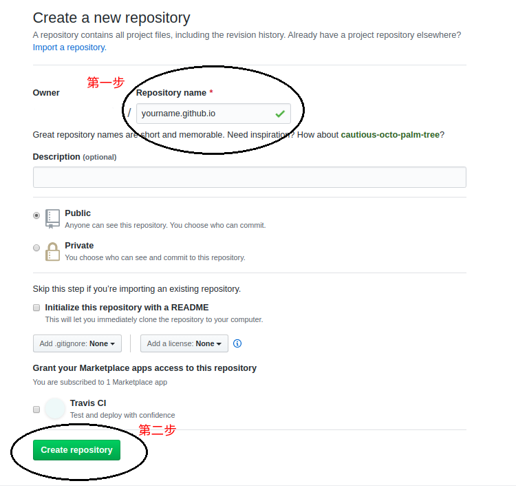

<table><tr><td bgcolor=gree>本文针对Ubuntu系统下的个人主页搭建</td></tr></table>
# 准备工作

<!-- - 一个GitHub帐号 -->
- 一个可供使用的电脑
- 排除万难的决心

<!-- # 新建仓库

1. 在GitHub中新建一个仓库，其中<span style="background-color:#00dd00">yourname</span>是你的GitHub账户名。

 -->

# 软件准备工作

需要的软件如下，其中前两个是Hexo的依赖
- Node.js
- Git
- Hexo

## 安装Node.js

执行以下命令可以完成安装，Hexo官方说明至少需要Node.js 8.10, 建议安装10.10或者更新的版本，以下为13.x的版本，当然你们也可使用其他符合要求的版本。

```bash
$  curl -sL https://deb.nodesource.com/setup_13.x | sudo -E bash -
$  sudo apt-get install -y nodejs
```

## 安装Git

Git是用于代码的版本控制与协作开发的利器。Ubuntu下可以使用<span style="background-color:#FFFF00">apt</span>商店进行安装


```bash
$  sudo apt-get install git-core
```

## 安装Hexo

如果你顺利的完成了Node.js和Git的安装，你可以通过<span style="background-color:#FFFF00">npm</span>软件包管理器安装Hexo博客框架。

```bash
$  npm install -g hexo-cli
```

# 开始搭建网站

下面就可以开始搭建个人博客网站了，
初始化一个博客，输入：

```bash
$  hexo init hexo-blog
```

在这过程中，你可以看到以下消息

```
   INFO  Cloning hexo-starter https://github.com/hexojs/hexo-starter.git
   Cloning into '/home/long/Long/hexo-blog'...
   remote: Enumerating objects: 30, done.
   remote: Counting objects: 100% (30/30), done.
   remote: Compressing objects: 100% (24/24), done.
   remote: Total 161 (delta 12), reused 12 (delta 4), pack-reused 131
   Receiving objects: 100% (161/161), 31.79 KiB | 0 bytes/s, done.
   Resolving deltas: 100% (74/74), done.
   Checking connectivity... done.
   Submodule 'themes/landscape' (https://github.com/hexojs/hexo-theme-landscape.git) registered for path 'themes/landscape'
   Cloning into 'themes/landscape'...
   remote: Enumerating objects: 32, done.
   remote: Counting objects: 100% (32/32), done.
   remote: Compressing objects: 100% (25/25), done.
   remote: Total 1054 (delta 20), reused 13 (delta 7), pack-reused 1022
   Receiving objects: 100% (1054/1054), 3.21 MiB | 605.00 KiB/s, done.
   Resolving deltas: 100% (578/578), done.
   Checking connectivity... done.
   Submodule path 'themes/landscape': checked out '73a23c51f8487cfcd7c6deec96ccc7543960d350'
   INFO  Install dependencies
   ...
   INFO  Start blogging with Hexo!
```

其实，在这一步中，首先会把Hexo博客框架的内容克隆到你指定的文件夹中，还包括了Hexo的默认主题<span style="background-color:#FFFF00">landscape</span>, 同时还会安装Hexo博客框架的一些其他依赖工具。

接下来，就可以通过执行以下命令在本地查看你刚完成的个人博客了。
```bash
$  hexo generate
$  hexo server
```
然后在浏览器中输入[localhost:4000](localhost:4000)就能看到你的个人博客啦！

